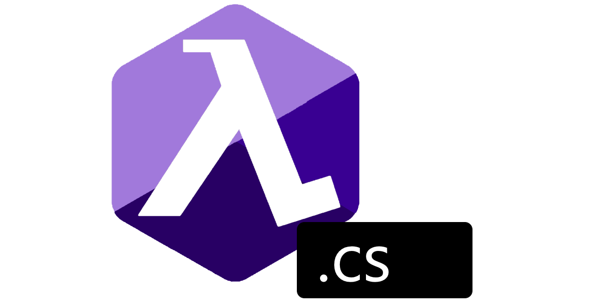

<p align="center">
  
  
  
</p>

<h1 align="center">FunctionalSharp</h1>
<p align="center">Functional types and patterns for C#</p>

<p align="center">
  
  
  
</p>
  
| FunctionalSharp | Vanilla |
| :-------------: | :-----: |
|  |  |
| <ul><li>Flat, monadic composition</li><li>No boilerplate (try/catch, TryParseXXX, ...)</li></ul> | <ul><li>try/catch boilerplate</li><li>Clunky TryParseXXX pattern</li></ul> |
|  |  |
| <ul><li>One line</li><li>Infinite ranges</li></ul> | <ul><li>Difficult to read</li></ul> |
|  |  |
| <ul><li>List pattern matching</li><li>Functional style singly linked list</li></ul> | <ul><li>Mutates original collection</li></ul> |

## Setup
Install the package from nuget or add a reference to the dll in your project.

Then, all you need to do is add 
```cs
global using FunctionalSharp;
global using static FunctionalSharp.F;
global using Unit = System.ValueTuple;
```
into a file for each **project** you want to use this lib in.

## Documentation
XML docs are provided for most functions and types.
If these are insufficient, you can always look at the source code; I've tried my best to make the code as pretty as 
possible.

Usage examples and information about key types are provided in [Types](#types)

## Types
## Unit
`Unit` is defined as `using Unit = System.ValueTuple;`. To return `Unit` from a method, simply use `return Unit()`.

`Unit` is advantageous over `void` because `void` cannot be used like a real type. Using `Unit` in place of `void` lets 
you do things like interop between `Func` and `Action`, or make Linq queries easier. You can easily convert an `Action`
to a `Unit`-returning `Func` by using `.ToFunc()`.

In fact, there have even been discussions about adding [`Unit`-like functionality to C#](https://github.com/dotnet/csharplang/blob/2802e29f4c539faa058855f54b5653daa9c087b2/meetings/2021/LDM-2021-10-25.md#delegate-type-argument-improvements).

## Maybe
`Maybe` is a discriminated union type with two possible states: `Just`, and `Nothing`. Instead of returning `null` or throwing
an exception, consider returning `Maybe` instead. 

`Maybe` is advantageous over `null` because the compiler forces you to handle both states. Furthermore, your function signature
communicates the purpose better, and the method becomes honest.

To create a `Maybe`, you can use `Just()` or `Nothing`.
```cs
Maybe<int> a = Just(1);
Maybe<string> b = Nothing;
```

Here's an example of making a safe `Get` function for `IDictionary`
```cs
public static Maybe<V> Get<K, V>(this IDictionary<K, V> map, K key) {
    if (map.TryGetValue(key, out T value))
        return value; //works because of implicit conversions. use Just() if you don't like them
    
    return Nothing;
}
```

## Map
`Map` is an immutable dictionary implementation, similar to `ImmutableSortedDictionary`. Under the hood, `Map` uses an 
AVL tree for `O(log n)` search, insert, and delete.

You can easily construct a map by using the `Map()` factory function or using `.ToMap()`. All common operations are defined
including custom comparers for the AVL tree, `Get()`, `Lookup()`, etc. Heck, you can even concat two maps with `+` 😉.

## Lst
`Lst` is an implementation of the functional immutable singly linked list. You can easily construct one with `List()` or `ToLst()`.

`Lst` includes common functional operations like pattern matching head and tail, prepending, slices, etc.

## Either
[`Either` is the functional way of error handling](https://hackage.haskell.org/package/base-4.16.0.0/docs/Data-Either.html).<br>
Instead of throwing exceptions (dishonest methods, disrupt program flow, etc) consider returning `Either` instead. It's a discriminated
union type with two states: `Left` or `Right`.

`Left` represents an error value, while `Right` represents a success value. `Either` is different from `Maybe` because you can add
additional information to the fail state.

Example:
```cs
public Either<OutOfBoundError, int[]> Slice(int[] arr, int index, int count) {
    if (index < 0) return new($"{nameof(index)} must be non-negative");
    if (count < 0) return new($"{nameof(count)} must be non-negative");
    if (index + count > arr.Length) return new($"({nameof(index)}, {nameof(count)}) must represent a range of indices within the array");
    
    ...
}
```

## Range
`Range` is a port of [Haskell's ranges](https://riptutorial.com/haskell/example/9516/ranges). Try one out with 
`Range()` function, but **make sure to use named arguments because some args are optional**. The `from`, `second`, 
and `to` arguments come from Haskell -- `[from,second..to]`.

Because it uses iterators, `Range` supports infinite ranges, `char` ranges, etc.

## IO
`IO` is a monad that lets you interact with real world IO, or any side-effecting computations. Importantly, it lets
you do this while keeping your code pure and exceptions compartmentalized. Additionally, `IO` also contains a type
paramater that allows you to pass in your own typeclass (custom environments).

`IO` is very similar to [Haskell's `IO` monad](https://www.haskell.org/tutorial/io.html). Essentially, `IO<string>` 
is a wrapper that will perform some action to get a string when invoked. Because it is a monad, you can also chain 
these computations and lift pure functions.

In order to print a file to the console, let's first import the runtimes for File and Console.
`File` and `Console` are static classes that emulate the .NET BCL. However, they return `IO` monads instead of the real types.
```cs
using static FunctionalSharp.Wrappers.File<FunctionalSharp.Wrappers.LiveRuntime>;
using static FunctionalSharp.Wrappers.Console<FunctionalSharp.Wrappers.LiveRuntime>;
```

Next, we need to define the `IO`-returning function. The signature returns `Unit` because we are reading the file,
printing the contents, then throwing the contents away.
```cs
static IO<LiveRuntime, Unit> PrintFile(string path)
```

Then, let's read the file and print it out. We accomplish this with a Linq query (`ReadAllText` and `WriteAllText` return IO
monads).
```cs
from txt in ReadAllText(path)
from _ in WriteLine(txt)
select Unit();
```

Finally, let's run the method <br>
Note: In this case we are tossing the result of the operation
```cs
PrintFile("myfile.txt").Run(new LiveRuntime());
```

If we wanted to do an in-between operation with a pure method, we can simply add another `let` clause to our query
or lift a pure function
```cs
static IO<LiveRuntime, Unit> PrintFile(string path)
    => from txt in ReadAllText(path)
       let newTxt = txt.Replace("\r\n", "\n")
       from _ in WriteLine(newTxt)
       select Unit();
       
static IO<LiveRuntime, Unit> PrintFile(string path)
    => from txt in ReadAllText(path)
       //we use IOSucc to lift because .Replace is pure
       from newTxt in IOSucc<LiveRuntime, string>(txt.Replace("\r\n", "\n"))
       from _ in WriteLine(newTxt)
       select Unit();
```

